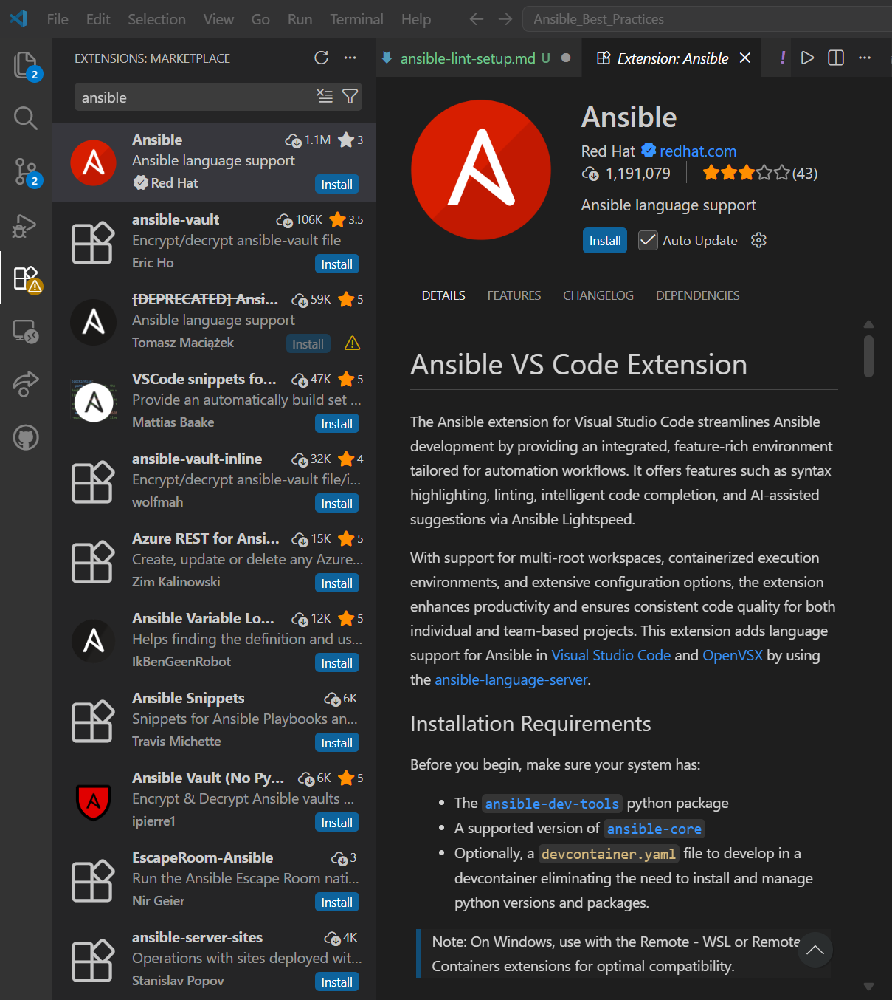
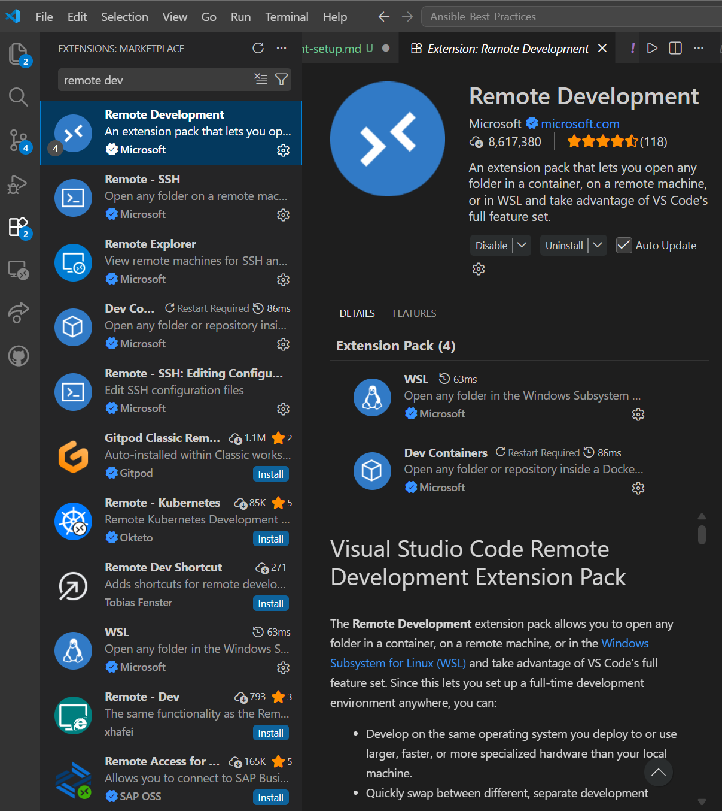
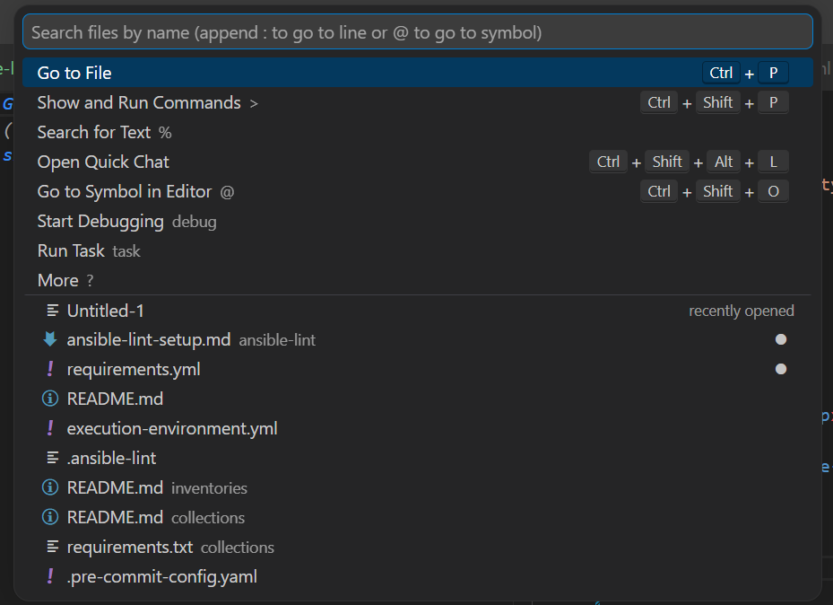
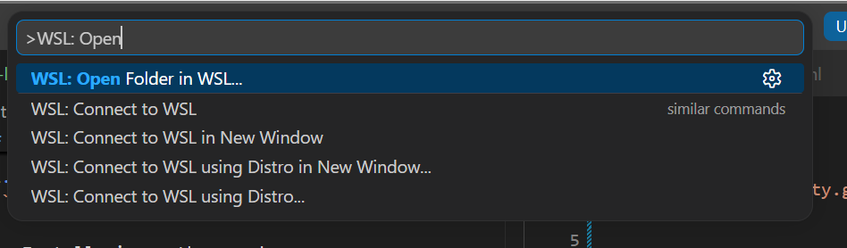

# Ansible Lint WSL Setup
--------------------------
This is a guide for configuring ansible-lint in a Windows environment.

To begin with this guide, please first install wsl and vs code 


1. Install ubuntu wsl instance: Open powershell and in type the following command
```wsl --install```

*note you may need to restart your system to allow for wsl changes to be made

2. Update package manager
```sudo apt-get update```

3. Install pipx python package manager
```sudo apt install pipx```

4. Install Ansible-lint
```pipx install ansible-lint```

5. Ensure proper pathing for ansible-lint
```pipx ensurepath```

6. Please swap over to your VScode now

7. In VS code navigate to the Extensions tab on the right side and search for and install Ansible


*if prompted to install python please do so at this time

8. In the same tab, also search for and install Remote Development


9. To begin development with ansible lint, go to the search box at the top of the page and click "show and run commands"(or ctrl + shift + p)


10. After clicking show commands, type in "WSL: Open folder in wsl" and choose the folder where your ansible code lives



